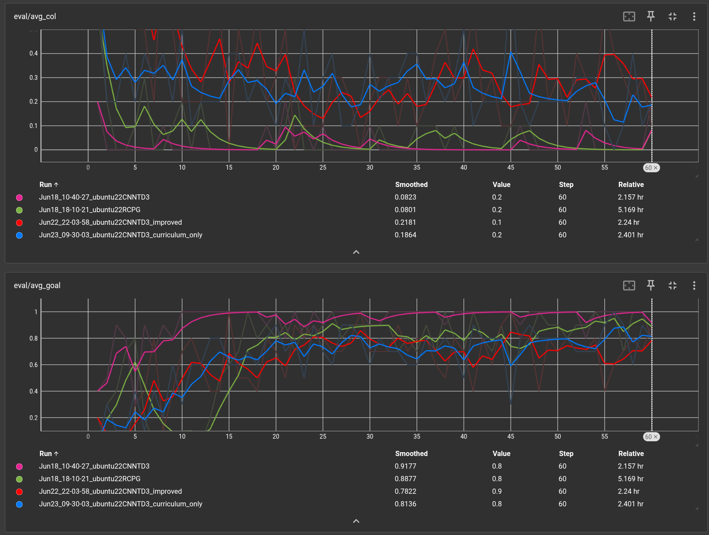
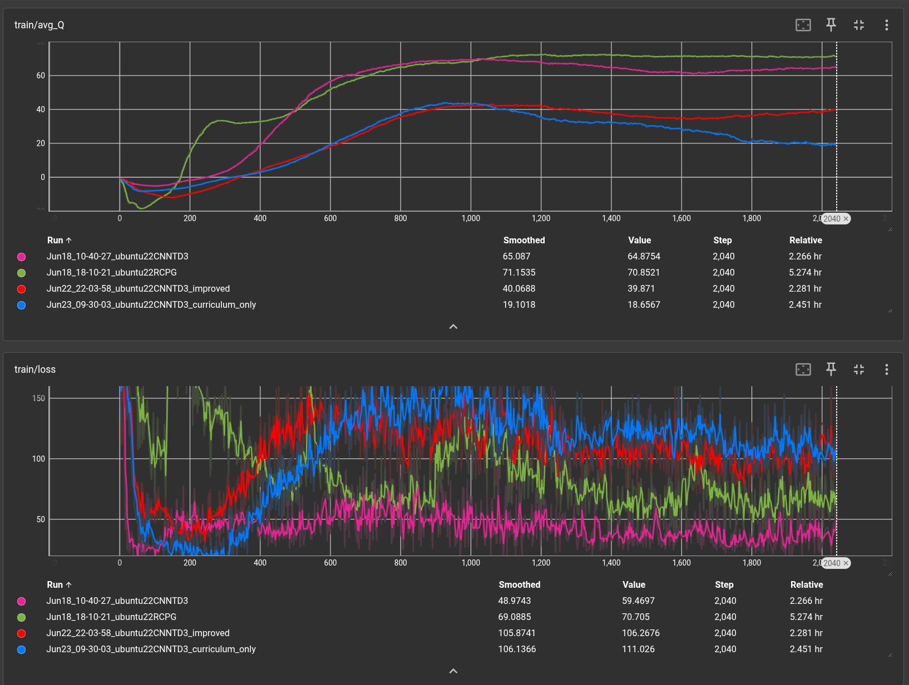
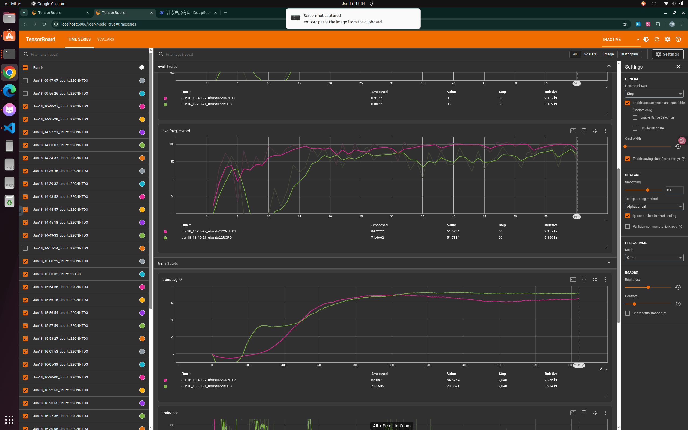
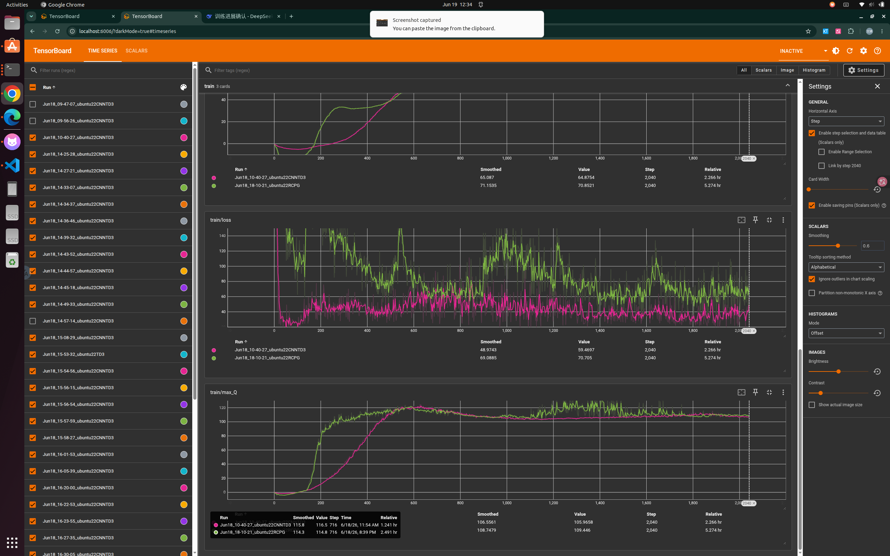

# Weekly Progress Log

> Update this file **every week**. Add a new entry at the top for each week.
> This is the first thing we check during review. Keep it honest and specific — it also feeds your attendance record (Rule 1).

**How to use:** copy the *Week template* block below for each new week. Newest week goes at the top.

---

## Week template — copy me

### Week N — YYYY-MM-DD

**Attended this week's meeting:** Yes / No (if No, did you email leave? Yes / No)

**Progress this week**
- _What did you actually do / finish?_

**Challenges & blockers**
- _What got in the way? What are you stuck on?_

**Next steps**
- _What will you do next week?_

**Hours spent (optional):** _e.g. 6h_

**Links (optional):** _commits, notebooks, docs, datasets..._

---

<!-- =================  YOUR ENTRIES BELOW  ================= -->
### Week 3 — 2026-06-22

**Attended this week's meeting:** 

**Progress this week**

- Trained CNNTD3_improved (curriculum learning + exploration reward), 60 epochs, ~2.3h
- Trained CNNTD3_curriculum_only (ablation: curriculum learning without exploration reward), 60 epochs, ~2.4h
- Evaluated both on 4 hard scenarios (S1, S2, S3, S5; dropped S4 due to scene design issues)
- Completed ablation study separating contributions of curriculum learning vs exploration reward
- TensorBoard 4-way comparison across all trained models

---

#### Part 1: Ablation Study Results

Four models tested on 4 structured hard scenarios:

| Scenario | CNNTD3 | RCPG (GRU) | Curriculum Only | CL + Exploration |
|---|---|---|---|---|
| **Standard env (baseline)** | **92%** | 88% | ~81% | ~78% |
| S1 U-trap | 0% | 0% | 0% | **100%** |
| S2 Double-U | 33% | 0% | **67%** | 33% |
| S3 Narrow door (0.45m) | 4.8% | **90.5%** | 9.5% | 0% |
| S5 Symmetric corridor | 83% | **100%** | **100%** | **100%** |

**Key ablation findings:**

1. **Exploration reward is the critical factor for U-trap escape.**
   Curriculum learning alone (S1 SR=0%) does not solve the U-trap.
   Adding exploration reward on top of curriculum learning pushes S1 to 100%.
   The exploration bonus teaches the agent "don't stay in one place" —
   exactly the missing behavior for escaping concave traps.

2. **Curriculum learning alone improves Double-U (33%→67%) and symmetric corridor (83%→100%).**
   Exposure to U-shaped structures during training helps even without exploration reward.

3. **Trade-off: hard-scenario improvements come at the cost of standard-environment SR.**
   Standard environment drops from 92% to ~78–81% with curriculum training.
   This is expected: training time is split between standard and hard scenarios.

4. **No single method dominates all scenarios.**
   RCPG excels at narrow doors (90.5%) but fails at traps (0%).
   CL+Exploration excels at U-trap (100%) but fails at narrow doors (0%).
   This confirms the need for scenario-specific solutions or a combined approach.

---

#### Part 2: TensorBoard Training Comparison

eval/avg_goal: CNNTD3 (pink) converges highest (~0.92), RCPG (green) reaches ~0.88,
curriculum_only (blue) reaches ~0.81, improved (red) reaches ~0.78.
Both curriculum variants show more training instability due to environment switching.

train/avg_Q: curriculum variants (red, blue) have lower avg_Q (~20–40) than
CNNTD3/RCPG (~65–70), reflecting the harder training distribution.
train/loss: curriculum variants show higher and more variable loss,
consistent with the mixed-difficulty training regime.

---

#### Part 3: Analysis — Why Standard SR Drops

The standard-environment SR drop (92%→78%) has three causes:

1. **Training budget dilution**: 50% of later episodes use hard scenarios,
   reducing standard-environment training data by half.
2. **Exploration reward side effects**: the anti-stagnation penalty
   makes the agent more aggressive, increasing collision rate
   in standard environments (avg_col 0.08→0.22).
3. **Reward distribution shift**: hard scenarios produce different
   reward distributions, making the critic's value estimates noisier.

Potential fix (future work): increase total training epochs proportionally,
or use separate replay buffers for standard and hard experiences.

---

**Challenges & blockers**

- Computer shut down during overnight training, lost partial progress.
  Resolved by restarting from scratch (no checkpoint resume support in current codebase).
- Exploration reward parameters (bonus=0.3, penalty=-0.2, stall threshold=15)
  were set manually without systematic tuning. Better results likely achievable
  with hyperparameter search.
- S4 dead-end maze scene design too restrictive (corridors too narrow for any model);
  dropped from final evaluation.

**Next steps**

1. Read related papers for positioning:
   - "Pushing the Limits of Reactive Planning" (2024) — LSTM + FFN 2-stage training
   - Kim et al. 2024 — APF + wall-following hybrid
   - DreamFlow (2026) — environment prediction for local minima escape
2. Design generalization test: create new U-trap variants not seen during training
3. Consider increasing training budget (more epochs) to recover standard-env SR

**Hours spent:** 

**Links:**
- Training logs: `cnntd3_improved_train.log`, `curriculum_only_train.log`
- Test results: `improved_hard_scenario_results.csv`
- Test scripts: `test_improved_hard_scenarios.py`, `test_curriculum_only.py`
- TensorBoard: `runs/Jun22_*CNNTD3_improved`, `runs/Jun23_*curriculum_only`

### Week 2 — 2026-06-15

**Attended this week's meeting:** Yes

**Progress this week**

- Completed Habitat PPO PointNav baseline (SR=0.85, SPL=0.65)
- Ran reward shaping experiments (2 variants), both underperformed baseline
- Tested NeuPAN (TRO 2025) on 3 scenarios for comparison
- Built 5 structured hard-scenario test environments in IR-SIM
- Evaluated CNNTD3 (SR=92% baseline) across all 5 hard scenarios
- Trained RCPG (GRU + TD3) and evaluated on the same 5 hard scenarios
- Discovered GRU memory is a double-edged sword: helps precision/symmetry, hurts in concave traps

---

#### Part 1: Habitat PPO Baseline & Reward Shaping

**Baseline training** (PPO, van-gogh-room scene):
- update 0: success = 0.000
- update ~650: success first appears (0.333)
- update ~12000: success ≈ 0.85, SPL ≈ 0.65

Three phases observed: (1) Learning (update 0–2000): SR rises 0→0.75;
(2) Convergence (2000–12000): stabilizes at SR~0.85, SPL~0.65;
(3) Fluctuation: caused by scene switching, not training failure.

**Reward shaping experiments**

| Experiment | Penalty | Result |
|---|---|---|
| Baseline | none | SR ~0.85, SPL ~0.65, converges fast |
| Experiment 1 | −0.5 | Failed: agent stops moving entirely |
| Experiment 2 | −0.1 | SR ~0.6, convergence 3× slower |

Key finding: naive collision penalties hurt more than they help.
Penalty −0.5 dominates early reward signal, preventing exploration.
Penalty −0.1 makes agent overly cautious.

**Success Cases**

| | |
|:---:|:---|
|  | **Case 1: Near-optimal navigation (SPL=0.99)**   Start: distance=1.98m → End: success=1, SPL=0.99   Agent moves directly toward goal with minimal turns.   SPL=0.99 means path was almost identical to shortest path.   Represents the best-case behavior of the trained policy. |
|  | **Case 2: Medium distance success (SPL=0.96)**   Start: distance=4.82m → End: success=1, SPL=0.96   Longer episode, agent maintains goal-directed movement.   Confirms policy generalizes across different starting distances. |
|  | **Case 3: van-gogh-room success (SPL=0.98)**   Start: distance=2.12m → End: success=1, SPL=0.98   Simple room layout allows agent to find efficient path.   Training scene — policy performs best in familiar environments. |

---

**Failure Cases**

| | |
|:---:|:---|
|  | **Case 1: Wall-stuck failure**   Start: distance=3.92m → End: distance=5.28m (got further away)   Agent spawns facing a wall, depth camera sees only darkness.   Repeatedly collides, moves away from goal instead of toward it.   **Root cause:** no obstacle avoidance or recovery strategy. |
|  | **Case 2: Long-distance failure**   Start: distance=11.81m → End: distance=11.81m (no movement)   Goal far outside training distribution, agent barely moves.   **Root cause:** policy not generalized to long-horizon tasks.   **Proposed fix:** curriculum learning. |
|  | **Case 3: Immediate termination**   Duration: 0.2s, episode ends almost instantly.   Goal distance: 12.32m — beyond policy capability.   **Root cause:** episode difficulty exceeds policy capability.   Suggests evaluation set contains unsolvable episodes, inflating failure rate. |

---

#### Part 2: NeuPAN Comparison

NeuPAN (TRO 2025): model-based neural planner using MPC optimization.

| Scenario | Result | Notes |
|---|---|---|
| corridor (static) | ✅ Success | Smooth path, 0.083ms/step |
| dyna_obs (dynamic) | ❌ Failed | MPC horizon insufficient |
| non_obs (non-convex) | ✅ Success | Handles irregular shapes |

| | |
|:---:|:---|
|  | **Corridor navigation**   Robot navigates through corridor with static obstacles.   Green wave trajectory shows real-time path adjustment.   Forward execution time: **0.083ms** per step.   Successfully reaches goal in 20.4s. |
|  | **Dynamic obstacles (failed)**   Moving circular obstacles cross the robot path.   Robot collides and fails to reach goal.   **Root cause:** MPC prediction horizon insufficient   for fast-moving obstacles. Known NeuPAN limitation. |
|  | **Non-convex obstacles**   Irregular-shaped obstacles scattered in environment.   Robot successfully navigates around all obstacles.   Point-level constraints handle arbitrary shapes without   requiring explicit shape models. |

---

#### Part 3: CNNTD3 Hard Scenario Benchmark

Trained CNNTD3 checkpoint: CNN + TD3, state_dim=185, 180-beam LiDAR.
Training: 60 epochs × 70 episodes, 3h on RTX 5060. Baseline SR=92%.

5 structured hard scenarios designed and tested:

| Scenario | SR | CR | TR | Failure Mode |
|---|---|---|---|---|
| S1 U-trap | **0%** | 0% | 100% | Freeze/oscillate inside U |
| S2 Double-U (facing up/left) | **33%** | 0% | 67% | Enters U, cannot exit |
| S3 Narrow door (0.45m) | **5%** | 95% | 0% | Collision at doorframe |
| S4 Dead-end maze | **67%** | 0% | 33% | Enters dead-end, timeout |
| S5 Symmetric corridor (facing left) | **0%** | 0% | 100% | Symmetric LiDAR deadlock |

Two core failure modes identified:

**Mode A — Concave trap (S1, S2, S4):** Goal signal points through wall;
reactive policy cannot generate backtrack behavior.

**Mode B — Symmetric deadlock (S5):** Identical upper/lower LiDAR readings
produce near-zero angular velocity; deterministic policy cannot break symmetry.

Narrow door threshold: SR=100% when width ≥ 0.6m (1.5× robot diameter),
SR≈0% when width < 0.5m.

---

#### Part 4: RCPG Training & Hard Scenario Comparison

Trained RCPG (GRU + TD3) on the same standard environment.
Training: 60 epochs × 70 episodes, ~15h on RTX 5060. Baseline SR=88%.

. 

TensorBoard eval curves: CNNTD3 (pink) converges faster (~epoch 5–10),
RCPG (green) converges later (~epoch 25) but reaches comparable SR.

.

Training curves: both models converge to similar avg_Q values (~105–110),
but RCPG has higher train/loss due to GRU sequential computation overhead.

.

**RCPG vs CNNTD3 on hard scenarios:**

| Scenario | CNNTD3 SR | RCPG SR | Δ | Interpretation |
|---|---|---|---|---|
| S1 U-trap | 0% | 0% | 0 | Both fail: neither can backtrack |
| S2 Double-U | 33% | 0% | **−33%** | GRU increases path persistence |
| S3 Narrow door | 4.8% | 90.5% | **+85.7%** | GRU enables precise alignment |
| S4 Dead-end maze | 67% | 0% | **−67%** | GRU prevents course correction |
| S5 Symmetric corridor | 83% | 100% | **+17%** | GRU breaks symmetric deadlock |

**Key finding: GRU memory is a double-edged sword.**
GRU improves precision (+85.7% narrow door) and breaks symmetry (+17%),
but actively hurts concave trap performance (−33% to −67%).
The GRU makes the agent more persistent in its trajectory — helpful
when correct, harmful when entering a dead-end.

**Root cause:** The U-trap failure (SR=0% for both) is a training
distribution problem, not an architecture problem. Neither model
saw backtracking scenarios during training.

---

#### Part 5: Literature Review — Local Minima Escape (2024–2026)

| Method | Paper | Limitation |
|---|---|---|
| APF + wall-following | Kim et al. 2024 | Requires manual trap detector |
| Reward shaping + map | Miranda et al. 2024 (IEEE TIE) | Needs map, violates mapless |
| Spatial recurrent unit | SRU, 2025 | Full architecture redesign |
| Environment prediction | DreamFlow, 2026 | Requires generative model |
| Interaction bias analysis | Jain et al. 2026 | Analysis only, no solution |

---

**Challenges & blockers**

- PyTorch 2.6 checkpoint incompatibility: fixed with weights_only=False
- Collision penalty −0.5 killed learning: documented as failed experiment
- NeuPAN dependency conflicts: resolved with separate conda env
- IR-SIM wall placement: linestring segments must be placed individually
- CNNTD3 vs TD3 class mismatch: fixed import and state_dim (185 not 25)
- RCPG training 8 (3× CNNTD3): ran overnight with hibernate disabled

**Next steps**

1. Implement curriculum learning: add U-trap to training rotation
2. Add exploration reward to penalise revisiting same positions
3. Re-train with curriculum + exploration reward
4. Evaluate improved model on all 5 hard scenarios

**Hours spent:** 

**Links:**
- [Training curve](../src/training_curve.png)
- [Comparison curve](../src/comparison_curve.png)
- [TensorBoard eval](../src/tensorboard_eval.png)
- [TensorBoard train](../src/tensorboard_train.png)
- [TensorBoard loss](../src/tensorboard_loss.png)
- Success cases: [SPL=0.99](../src/success_1.gif), [SPL=0.96](../src/success_2.gif), [SPL=0.98](../src/success_3.gif)
- Failure cases: [wall-stuck](../src/failure_1.gif), [far goal](../src/failure_2.gif), [terminated](../src/failure_3.gif)
- NeuPAN: [corridor](../src/corridor_diff_ani.gif), [dynamic](../src/dyna_obs_diff_ani.gif), [non-convex](../src/non_obs_diff_ani.gif)
- Hard scenario scripts: [u-trap](../src/test_u_trap_cnntd3.py), [maze](../src/test_dead_end_maze.py), [narrow-door](../src/test_narrow_door.py), [s5-s2](../src/test_s5_s2.py), [rcpg-all](../src/test_rcpg_hard_scenarios.py)
- World files: [u-trap](../src/u_trap_world.yaml), [maze](../src/dead_end_maze_world.yaml), [narrow-door](../src/narrow_door_world.yaml), [corridor](../src/symmetric_corridor_world.yaml), [double-u](../src/double_u_world.yaml)
- Results: [u-trap](../src/u_trap_results.csv), [maze](../src/dead_end_maze_results.csv), [narrow-door](../src/narrow_door_results.csv), [s5-s2](../src/s5_s2_results.csv), [rcpg-all](../src/rcpg_hard_scenario_results.csv)

   
### Week 1 — 2026-06-6

**Attended this week's meeting:** Yes

**Progress this week**
- Installed Habitat-Lab + habitat-baselines on Ubuntu 22.04 (RTX 5060, 8GB VRAM).
- Selected reproduction target: DD-PPO (Wijmans et al., ICLR 2020).
- Studied core concepts: PointNav task, reward shaping, PPO, NeuPAN.
- Installed ROS 2 Humble on native Ubuntu 22.04 dual-boot system.
- Ran TurtleSim to verify basic ROS 2 node and topic communication.
- Locally deployed Qwen VLM (4-bit quantized, ~988MB VRAM) and built
  a mini VLN pipeline:
  natural language instruction → Qwen parses coordinates
  → ROS 2 topic → TurtleSim executes.
  Tested "go to top right corner" → successfully navigated to (10.0, 10.0).

**Challenges & blockers**
- Training instability: SR dropped from 88% to 0% on scene switch (generalization issue).
- PyTorch 2.6 / Habitat checkpoint incompatibility (`weights_only=True`): fixed by patching `ppo_trainer.py`.
- conda Python 3.9 vs ROS2 Python 3.10 conflict: resolved by separating Qwen (conda) and ROS2 (system Python) into two processes communicating via file.

**Next steps**
- Analyze success and failure cases in detail.
- Plot training curves from log data.
- Run longer PPO training for stronger baseline.

**Hours spent (optional):** 

**Links (optional):**
- [Success navigation demo](../src/success_navigation.gif)
- [Failure navigation demo](../src/failure_navigation.gif)
- [Qwen + TurtleSim demo](../src/qwen_turtlesim.png)
