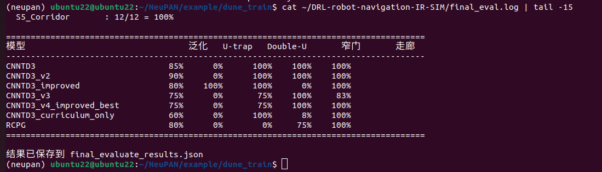

# Weekly Progress Log

> Update this file **every week**. Add a new entry at the top for each week.
> This is the first thing we check during review. Keep it honest and specific — it also feeds your attendance record (Rule 1).

**How to use:** copy the *Week template* block below for each new week. Newest week goes at the top.

---

## Week template — copy me

### Week N — YYYY-MM-DD

**Attended this week's meeting:** Yes / No (if No, did you email leave? Yes / No)

**Progress this week**
- _What did you actually do / finish?_

**Challenges & blockers**
- _What got in the way? What are you stuck on?_

**Next steps**
- _What will you do next week?_

**Hours spent (optional):** _e.g. 6h_

**Links (optional):** _commits, notebooks, docs, datasets..._

---

<!-- =================  YOUR ENTRIES BELOW  ================= -->


### Week 5 — 2026-07-06 / 07-07

**Attended this week's meeting:** 没开会

**Progress this week**

- 探索方向，基本确认走延迟感知导航
- Isaac Sim 6.0.1 + Isaac Lab 环境搭建 
- 进行NeuPAN延迟注入实验系列


#### 实验一：初步延迟注入（Action Delay）

在NeuPAN控制循环中加入action buffer队列，planner计算出的动作延迟d步后才执行。
但是action delay（加在planner→执行器之间）不符合真实场景，真实延迟应该在observation→agent之间。

---

#### 实验二：Action Chunking × 两种延迟类型

区分两种延迟类型，分别测试Action Chunking的效果：
- **Inference延迟**：拉长决策周期，每k步才规划一次，中间重复旧动作 vs 执行预规划轨迹(chunk)
- **观测延迟**：每步都规划，但输入是d步前的旧观测

Action Chunking实现方式：从NeuPAN的opt_trajectory（10步预规划状态序列）中提取动作序列，在chunk间隔内依次执行。

##### 结果

======================================================================
NeuPAN 延迟 × Action Chunking 统一对比
======================================================================
实验                             SR%    平均步数       平均震荡       横向偏移      
------------------------------------------------------------------
无延迟 + 无chunk（baseline）         100.0  150.0      66.0       0.0       
5步inference延迟 + 无chunk（重复旧动作）  100.0  151.0      26.0       0.1411    
无延迟 + 有chunk（chunk副作用检查）       100.0  150.0      10.0       0.0       
5步inference延迟 + 有chunk（chunk解决延迟） 100.0  151.0      6.0        0.0     


======================================================================
NeuPAN 观测延迟 × Action Chunking 对比结果
======================================================================
实验                                  SR%    步数       震荡       横向偏移      
-------------------------------------------------------------------
无延迟 + 无chunk（baseline）              100.0  150.0    66.0     0.0       
观测延迟5步(500ms) + 无chunk              100.0  229.0    17.0     1.8127    
无延迟 + chunk=5                       100.0  151.0    6.0      0.0       
观测延迟5步(500ms) + chunk=5             100.0  226.0    10.0     1.9073    

##### 关键发现
**Action Chunking对inference延迟有效，对观测延迟无效。** 因为观测延迟的问题是planner的输入本身就是错的（看到过去的世界），不管规划多少步，基础就是错的。Chunking解决"算得慢"，不解决"看得旧"。


#### 实验三：观测延迟 + 运动学状态预测补偿（固定步数延迟）

planner拿到d步前的旧robot_state后，用运动学模型+这d步执行过的历史动作前向推演，预测机器人当前真实状态：
```
predicted_x = delayed_x + Σ(v_i * cos(theta_i) * dt)
predicted_y = delayed_y + Σ(v_i * sin(theta_i) * dt)
predicted_theta = delayed_theta + Σ(w_i * dt)
```
##### 结果
======================================================================
结果汇总 (观测延迟=5步/500ms)
======================================================================
实验                             SR%    步数       震荡       横向偏移      
--------------------------------------------------------------
无延迟（baseline）                  100.0  150.0    66.0     0.0       
延迟5步 无补偿                       100.0  229.0    17.0     1.8127    
延迟5步 + 状态预测补偿                  100.0  149.0    70.0     0.0       
延迟5步 + chunk=5                 100.0  226.0    10.0     1.9073    
延迟5步 + 补偿 + chunk=5            100.0  156.0    6.0      0.0       

======================================================================
结果汇总 (观测延迟=10步/1000ms)
======================================================================
实验                             SR%    步数       震荡       横向偏移      
--------------------------------------------------------------
无延迟（baseline）                  100.0  150.0    66.0     0.0       
延迟10步 无补偿                      100.0  853.0    37.0     4.0254    
延迟10步 + 状态预测补偿                 100.0  150.0    68.0     0.0       
延迟10步 + chunk=5                100.0  711.0    20.0     4.5525    
延迟10步 + 补偿 + chunk=5           100.0  151.0    8.0      0.0       


##### 遇到的问题
**效果过于完美（偏移精确等于0.0）。** 分析原因：
1. 固定延迟步数 → 预测器知道精确推演多少步，不会出错
2. 仿真运动学模型完美匹配 → 预测无误差
3. 静态环境 → 延迟的LiDAR和当前LiDAR完全一样


---

#### 实验四：毫秒级连续随机延迟

将延迟单位从"步数"改为"毫秒"，每步随机采样delay_ms ~ Uniform(min, max)。处理非整数步：350ms对应3.5步，取第3步的观测，补偿时第一步只推演半步时间。（这个处理也存在不合理的地方）

======================================================================
结果汇总（延迟范围100-1000ms）
======================================================================
实验                                  SR%    步数       震荡       横向偏移       平均延迟ms    
-----------------------------------------------------------------------------
无延迟 baseline                        100.0  150.0    66.0     0.0        0.0       
随机延迟100-1000ms 无补偿                  100.0  179.0    32.0     1.9438     571.1     
随机延迟100-1000ms + 补偿                 100.0  150.3    84.7     0.0363     539.7     


##### 关键改善
横向偏移从0.0变成了0.04——不再完美，因为：
- 每步延迟不同，预测步数在1-10步之间波动
- 长预测步数累积更多误差
- 但仍然非常好（降了98%），因为**运动学模型在仿真中还是完美的**


---

#### 实验五：动态场景 + L1完整补偿

1. 创建带动态障碍物的走廊场景（2-5个RVO行为的圆形障碍物在走廊内随机移动）
2. 实现L1完整补偿：**自身状态运动学推演 + 障碍物点云线性外推**
   - 用NeuPAN自带的`scan_to_point_velocity`估计每个LiDAR点的速度
   - 线性外推：`predicted_points = delayed_points + point_velocities * delay_seconds`


===========================================================================
L1延迟补偿结果汇总 （动态场景，延迟100-1000ms，5次重复）
===========================================================================
实验                                  SR%    碰撞%     步数       震荡       横向偏移      
--------------------------------------------------------------------------
无延迟 baseline                        0.0    100.0   172.4    44.0     0.3653    
有延迟 无补偿                             0.0    100.0   245.8    27.8     1.8643    
有延迟 + 仅自身状态补偿                       0.0    100.0   210.4    62.6     0.2985    
有延迟 + 自身状态 + 障碍物外推(L1)              0.0    20.0    832.2    30.6     0.1085    

##### 关键发现

**L1的效果递进关系清晰：**
- B→C（加自身状态补偿）：横向偏移 1.86→0.30（降84%），但碰撞率不变（100%），因为只修正了自身位置，障碍物位置还是旧的
- C→D（加障碍物外推）：碰撞率 100%→20%（降80个百分点），横向偏移 0.30→0.11，步数 210→832（存活时间延长4倍）
- D仍然SR=0%：80%的case是超时而非碰撞，说明线性外推让机器人变得过于保守/迟疑

### 遇到的问题

1. **动态障碍物太多导致baseline就SR=0%**：最初用5个障碍物，NeuPAN无延迟就全部碰撞。
   - **解决**：减少到2个动态障碍物。即使如此baseline仍然SR=0%，说明NeuPAN对动态障碍物本身就有挑战（这和NeuPAN论文中动态场景失败的结论一致）。

2. **第一组0延迟实验三组结果不一致**：B组和C组的"0延迟"结果与A组不同。
   - **原因**：三组都是0延迟，差异来自动态障碍物的随机位置/行为不同。
   - **解决**：增加重复次数到5次取平均。

---

#### 实验设计的演进过程（踩坑记录）

| 版本 | 问题 | 修正 |
|------|------|------|
| v1 | 延迟加在action→plan之间 | 老师指正，改为observation→agent |
| v2 | 固定步数延迟 | 改为毫秒级连续延迟 |
| v3 | 每次运行固定一个延迟值 | 改为每步随机采样 |
| v4 | 只补偿自身状态 | 加入障碍物点云线性外推 |
| v5 | 静态场景补偿太完美 | 加入动态障碍物场景 |

---

#### 各实验脚本对应关系

| 脚本 | 功能 |
|------|------|
| test_neupan_delay_vis.py | 最初版：action delay + 可视化 |
| test_neupan_delay_fin.py | 多延迟模式（action/observation/inference） |
| test_neupan_unified.py | inference延迟 × action chunking 4组对比 |
| test_neupan_obs_delay.py | 观测延迟 × action chunking 4组对比 |
| test_neupan_compensate.py | 观测延迟 + 运动学补偿 5组对比（固定步数） |
| test_neupan_ms_delay.py | 毫秒级随机延迟 + 运动学补偿 |
| test_neupan_chunk.py | 纯Action Chunking测试 |
| test_neupan_L1.py | L1完整补偿（自身状态+障碍物外推）4组对比 |
| test_neupan_dynamic.py | 动态场景延迟测试 |

---

#### 总结：已验证的结论

1. **观测延迟导致NeuPAN性能显著下降**：横向偏移与延迟近似线性增长（500ms→1.8m, 1000ms→4.0m）
2. **Action Chunking只对inference延迟有效，对观测延迟无效**：两种延迟本质不同，需要不同的解决方案
3. **自身状态运动学补偿在静态场景几乎完美**：但这是因为仿真条件过于理想
4. **障碍物线性外推（L1）显著降低碰撞率**：100%→20%，但导致过度保守（超时）
5. **L1不够好→需要L2学习型预测器**：线性外推假设障碍物匀速直线，无法处理转弯/变速


**Challenges & blockers**

- NeuPAN对动态障碍物本身就表现较差（无延迟SR=0%），与NeuPAN论文中的dyna_obs实验结论一致，需调整场景难度
- 对比公平性问题：NeuPAN的DUNE无法注入延迟重训练，运动学补偿+障碍物外推已是MPC框架下的最佳适配方案，待与老师确认这是否构成公平对比
- L1线性外推导致机器人过于保守（超时），需要更智能的预测方法


**Next steps**

1. 探索neupan能否通过训练解决延迟问题（公平性的问题）
2. 加入**动态障碍物**测试状态预测补偿的局限性
3. 加入**传感器噪声和模型不确定性**测试鲁棒性
4. 探索一下是找个rl模型训练其解决延迟的能力还是直接改neupan


**Hours spent:**

**Links:**

---


### Week 4 — 2026-06-29 / 06-30

**Attended this week's meeting:** Yes

**Progress this week**

- 培训CNNTD3_v3：保守课程（最高20%），涵盖100个时代;标准SR≈70-80%，稳定性不及改进版
- 训练ATD3（Attention-TD3）：用多头替代CNN自我关注，100点激光雷达，10米射程;SR≈0% — 已废弃
- 训练CNNTD3_v4_improved：距离塑形奖励 + 120 个时代 + 最佳存档点;SR=75%，与基线无改善
- 尝试在NeuPAN DUNE重新训练TurtleBot3汉堡大小，发现neupan重新训练过后没办法通过Corridor navigation（可能还需要继续调整）
- 对所有已训练的CNNTD3变体进行系统性最终评估：20个概括试验+4个困难场景（S1 U型陷阱，S2 双U型，S3窄门，S5走廊），每个方向各3次
- 发现CNNTD3_v2具有最佳推广SR（90%），超过两者基线（85%）和改善（80%）——探索奖励强度为0.15（介于改进版0.3和v3的0.1之间）似乎是一个最佳平衡点
  训练CNNTD3_v2_continue_v2：从现有的v2检查点加载，继续运行40个epoch,SR并没有很高，失败
- 设计CNNTD3_v5_combined：结合了v2的适度探索改进版早期课程起始的奖励（0.15），既针对高泛化，也针对U型陷阱，U型陷阱效果比较好，泛化性较弱
- 方向混乱，论文看的不够，又回去看论文了
- https://arxiv.org/abs/2403.06828   （neupan原始论文）
- https://arxiv.org/pdf/2512.09537  （REASAN腿足RL避障）
- https://arxiv.org/pdf/2512.16760  （VLA for Autonomous Driving）
  
**Final Evaluation Results (independent test, not training eval)**



**Challenges & blockers**
- ATD3未能收敛且sr极低：可能是因为20×20世界过大，目标超出激光雷达范围
- 在长时间评估运行中达到的X11显示连接限制（创建476+ SIM实例）;通过重复使用SIM实例解决了这个问题，在每个测试阶段内设置剧集，而不是创建新实例
- 意外删除了robot_nav/runs/（v3/v4/ATD3曲线丢失）但模型还在
- IR-SIM崩溃，导致v5训练崩溃：IR-SIM 内部维护一棵空间索引树，用于快速查询激光雷达可能碰到的障碍物。object_tree.query() 返回的是索引编号，但这棵树是在场景    初始化时建立的，如果场景里的物体数量在运行过程中发生了变化，重建 SIM() 实例后，树和实际物   体列表短暂不同步，导致查询返回的索引超出了新场景的物体数量范围。


**Next steps**

-继续微调训练模型

-多看看论文，看更多的方向，和基础方法，微调效果比较差，loss比较大

**Hours spent:** 

**Links:**

---
### Week 3 — 2026-06-22

**Attended this week's meeting:** Yes

**Progress this week**

- Trained CNNTD3_improved (curriculum learning + exploration reward), 60 epochs, ~2.3h
- Trained CNNTD3_curriculum_only (ablation: curriculum learning without exploration reward), 60 epochs, ~2.4h
- Evaluated both on 4 hard scenarios (S1, S2, S3, S5; dropped S4 due to scene design issues)
- Completed ablation study separating contributions of curriculum learning vs exploration reward
- TensorBoard 4-way comparison across all trained models

---

#### Part 1: Ablation Study Results

Four models tested on 4 structured hard scenarios:

| Scenario | CNNTD3 | RCPG (GRU) | Curriculum Only | CL + Exploration |
|---|---|---|---|---|
| **Standard env (baseline)** | **92%** | 88% | ~81% | ~78% |
| S1 U-trap | 0% | 0% | 0% | **100%** |
| S2 Double-U | 33% | 0% | **67%** | 33% |
| S3 Narrow door (0.45m) | 4.8% | **90.5%** | 9.5% | 0% |
| S5 Symmetric corridor | 83% | **100%** | **100%** | **100%** |

**Key ablation findings:**

1. **Exploration reward is the critical factor for U-trap escape.**
   Curriculum learning alone (S1 SR=0%) does not solve the U-trap.
   Adding exploration reward on top of curriculum learning pushes S1 to 100%.
   The exploration bonus teaches the agent "don't stay in one place" —
   exactly the missing behavior for escaping concave traps.

2. **Curriculum learning alone improves Double-U (33%→67%) and symmetric corridor (83%→100%).**
   Exposure to U-shaped structures during training helps even without exploration reward.

3. **Trade-off: hard-scenario improvements come at the cost of standard-environment SR.**
   Standard environment drops from 92% to ~78–81% with curriculum training.
   This is expected: training time is split between standard and hard scenarios.

4. **No single method dominates all scenarios.**
   RCPG excels at narrow doors (90.5%) but fails at traps (0%).
   CL+Exploration excels at U-trap (100%) but fails at narrow doors (0%).
   This confirms the need for scenario-specific solutions or a combined approach.

---

#### Part 2: TensorBoard Training Comparison


eval/avg_goal: CNNTD3 (pink) converges highest (~0.92), RCPG (green) reaches ~0.88,
curriculum_only (blue) reaches ~0.81, improved (red) reaches ~0.78.
Both curriculum variants show more training instability due to environment switching.


train/avg_Q: curriculum variants (red, blue) have lower avg_Q (~20–40) than
CNNTD3/RCPG (~65–70), reflecting the harder training distribution.
train/loss: curriculum variants show higher and more variable loss,
consistent with the mixed-difficulty training regime.

---

#### Part 3: Analysis — Why Standard SR Drops

The standard-environment SR drop (92%→78%) has three causes:

1. **Training budget dilution**: 50% of later episodes use hard scenarios,
   reducing standard-environment training data by half.
2. **Exploration reward side effects**: the anti-stagnation penalty
   makes the agent more aggressive, increasing collision rate
   in standard environments (avg_col 0.08→0.22).
3. **Reward distribution shift**: hard scenarios produce different
   reward distributions, making the critic's value estimates noisier.

Potential fix (future work): increase total training epochs proportionally,
or use separate replay buffers for standard and hard experiences.

---

**Challenges & blockers**

- Computer shut down during overnight training, lost partial progress.
  Resolved by restarting from scratch (no checkpoint resume support in current codebase).
- Exploration reward parameters (bonus=0.3, penalty=-0.2, stall threshold=15)
  were set manually without systematic tuning. Better results likely achievable
  with hyperparameter search.
- S4 dead-end maze scene design too restrictive (corridors too narrow for any model);
  dropped from final evaluation.
- The debugging effect was not good.

**Next steps**

1. Read related papers for positioning:
   - "Pushing the Limits of Reactive Planning" (2024) — LSTM + FFN 2-stage training
   - Kim et al. 2024 — APF + wall-following hybrid
   - DreamFlow (2026) — environment prediction for local minima escape
2. Design generalization test: create new U-trap variants not seen during training
3. Consider increasing training budget (more epochs) to recover standard-env SR


**Hours spent:** 

**Links:**
- Training logs: `cnntd3_improved_train.log`, `curriculum_only_train.log`
- Test results: `improved_hard_scenario_results.csv`
- Test scripts: `test_improved_hard_scenarios.py`, `test_curriculum_only.py`
- TensorBoard: `runs/Jun22_*CNNTD3_improved`, `runs/Jun23_*curriculum_only`


### Week 2 — 2026-06-15

**Attended this week's meeting:** Yes

**Progress this week**

- Completed Habitat PPO PointNav baseline (SR=0.85, SPL=0.65)
- Ran reward shaping experiments (2 variants), both underperformed baseline
- Tested NeuPAN (TRO 2025) on 3 scenarios for comparison
- Built 5 structured hard-scenario test environments in IR-SIM
- Evaluated CNNTD3 (SR=92% baseline) across all 5 hard scenarios
- Trained RCPG (GRU + TD3) and evaluated on the same 5 hard scenarios
- Discovered GRU memory is a double-edged sword: helps precision/symmetry, hurts in concave traps

---

#### Part 1: Habitat PPO Baseline & Reward Shaping

**Baseline training** (PPO, van-gogh-room scene):
- update 0: success = 0.000
- update ~650: success first appears (0.333)
- update ~12000: success ≈ 0.85, SPL ≈ 0.65


Three phases observed: (1) Learning (update 0–2000): SR rises 0→0.75;
(2) Convergence (2000–12000): stabilizes at SR~0.85, SPL~0.65;
(3) Fluctuation: caused by scene switching, not training failure.

**Reward shaping experiments**

| Experiment | Penalty | Result |
|---|---|---|
| Baseline | none | SR ~0.85, SPL ~0.65, converges fast |
| Experiment 1 | −0.5 | Failed: agent stops moving entirely |
| Experiment 2 | −0.1 | SR ~0.6, convergence 3× slower |


Key finding: naive collision penalties hurt more than they help.
Penalty −0.5 dominates early reward signal, preventing exploration.
Penalty −0.1 makes agent overly cautious.

**Success Cases**

| | |
|:---:|:---|
|  | **Case 1: Near-optimal navigation (SPL=0.99)** <br> Start: distance=1.98m → End: success=1, SPL=0.99 <br> Agent moves directly toward goal with minimal turns. <br> SPL=0.99 means path was almost identical to shortest path. <br> Represents the best-case behavior of the trained policy. |
|  | **Case 2: Medium distance success (SPL=0.96)** <br> Start: distance=4.82m → End: success=1, SPL=0.96 <br> Longer episode, agent maintains goal-directed movement. <br> Confirms policy generalizes across different starting distances. |
|  | **Case 3: van-gogh-room success (SPL=0.98)** <br> Start: distance=2.12m → End: success=1, SPL=0.98 <br> Simple room layout allows agent to find efficient path. <br> Training scene — policy performs best in familiar environments. |

---

**Failure Cases**

| | |
|:---:|:---|
|  | **Case 1: Wall-stuck failure** <br> Start: distance=3.92m → End: distance=5.28m (got further away) <br> Agent spawns facing a wall, depth camera sees only darkness. <br> Repeatedly collides, moves away from goal instead of toward it. <br> **Root cause:** no obstacle avoidance or recovery strategy. |
|  | **Case 2: Long-distance failure** <br> Start: distance=11.81m → End: distance=11.81m (no movement) <br> Goal far outside training distribution, agent barely moves. <br> **Root cause:** policy not generalized to long-horizon tasks. <br> **Proposed fix:** curriculum learning. |
|  | **Case 3: Immediate termination** <br> Duration: 0.2s, episode ends almost instantly. <br> Goal distance: 12.32m — beyond policy capability. <br> **Root cause:** episode difficulty exceeds policy capability. <br> Suggests evaluation set contains unsolvable episodes, inflating failure rate. |


---

#### Part 2: NeuPAN Comparison

NeuPAN (TRO 2025): model-based neural planner using MPC optimization.

| Scenario | Result | Notes |
|---|---|---|
| corridor (static) | ✅ Success | Smooth path, 0.083ms/step |
| dyna_obs (dynamic) | ❌ Failed | MPC horizon insufficient |
| non_obs (non-convex) | ✅ Success | Handles irregular shapes |

| | |
|:---:|:---|
|  | **Corridor navigation** <br> Robot navigates through corridor with static obstacles. <br> Green wave trajectory shows real-time path adjustment. <br> Forward execution time: **0.083ms** per step. <br> Successfully reaches goal in 20.4s. |
|  | **Dynamic obstacles (failed)** <br> Moving circular obstacles cross the robot path. <br> Robot collides and fails to reach goal. <br> **Root cause:** MPC prediction horizon insufficient <br> for fast-moving obstacles. Known NeuPAN limitation. |
|  | **Non-convex obstacles** <br> Irregular-shaped obstacles scattered in environment. <br> Robot successfully navigates around all obstacles. <br> Point-level constraints handle arbitrary shapes without <br> requiring explicit shape models. |

---

#### Part 3: CNNTD3 Hard Scenario Benchmark

Trained CNNTD3 checkpoint: CNN + TD3, state_dim=185, 180-beam LiDAR.
Training: 60 epochs × 70 episodes, 3h on RTX 5060. Baseline SR=92%.

5 structured hard scenarios designed and tested:

| Scenario | SR | CR | TR | Failure Mode |
|---|---|---|---|---|
| S1 U-trap | **0%** | 0% | 100% | Freeze/oscillate inside U |
| S2 Double-U (facing up/left) | **33%** | 0% | 67% | Enters U, cannot exit |
| S3 Narrow door (0.45m) | **5%** | 95% | 0% | Collision at doorframe |
| S4 Dead-end maze | **67%** | 0% | 33% | Enters dead-end, timeout |
| S5 Symmetric corridor (facing left) | **0%** | 0% | 100% | Symmetric LiDAR deadlock |

Two core failure modes identified:

**Mode A — Concave trap (S1, S2, S4):** Goal signal points through wall;
reactive policy cannot generate backtrack behavior.

**Mode B — Symmetric deadlock (S5):** Identical upper/lower LiDAR readings
produce near-zero angular velocity; deterministic policy cannot break symmetry.

Narrow door threshold: SR=100% when width ≥ 0.6m (1.5× robot diameter),
SR≈0% when width < 0.5m.

---

#### Part 4: RCPG Training & Hard Scenario Comparison

Trained RCPG (GRU + TD3) on the same standard environment.
Training: 60 epochs × 70 episodes, ~15h on RTX 5060. Baseline SR=88%.

. 


TensorBoard eval curves: CNNTD3 (pink) converges faster (~epoch 5–10),
RCPG (green) converges later (~epoch 25) but reaches comparable SR.

.

Training curves: both models converge to similar avg_Q values (~105–110),
but RCPG has higher train/loss due to GRU sequential computation overhead.

.

**RCPG vs CNNTD3 on hard scenarios:**

| Scenario | CNNTD3 SR | RCPG SR | Δ | Interpretation |
|---|---|---|---|---|
| S1 U-trap | 0% | 0% | 0 | Both fail: neither can backtrack |
| S2 Double-U | 33% | 0% | **−33%** | GRU increases path persistence |
| S3 Narrow door | 4.8% | 90.5% | **+85.7%** | GRU enables precise alignment |
| S4 Dead-end maze | 67% | 0% | **−67%** | GRU prevents course correction |
| S5 Symmetric corridor | 83% | 100% | **+17%** | GRU breaks symmetric deadlock |

**Key finding: GRU memory is a double-edged sword.**
GRU improves precision (+85.7% narrow door) and breaks symmetry (+17%),
but actively hurts concave trap performance (−33% to −67%).
The GRU makes the agent more persistent in its trajectory — helpful
when correct, harmful when entering a dead-end.

**Root cause:** The U-trap failure (SR=0% for both) is a training
distribution problem, not an architecture problem. Neither model
saw backtracking scenarios during training.

---

#### Part 5: Literature Review — Local Minima Escape (2024–2026)

| Method | Paper | Limitation |
|---|---|---|
| APF + wall-following | Kim et al. 2024 | Requires manual trap detector |
| Reward shaping + map | Miranda et al. 2024 (IEEE TIE) | Needs map, violates mapless |
| Spatial recurrent unit | SRU, 2025 | Full architecture redesign |
| Environment prediction | DreamFlow, 2026 | Requires generative model |
| Interaction bias analysis | Jain et al. 2026 | Analysis only, no solution |

---

**Challenges & blockers**

- PyTorch 2.6 checkpoint incompatibility: fixed with weights_only=False
- Collision penalty −0.5 killed learning: documented as failed experiment
- NeuPAN dependency conflicts: resolved with separate conda env
- IR-SIM wall placement: linestring segments must be placed individually
- CNNTD3 vs TD3 class mismatch: fixed import and state_dim (185 not 25)
- RCPG training 8 (3× CNNTD3): ran overnight with hibernate disabled

**Next steps**

1. Implement curriculum learning: add U-trap to training rotation
2. Add exploration reward to penalise revisiting same positions
3. Re-train with curriculum + exploration reward
4. Evaluate improved model on all 5 hard scenarios

**Hours spent:** 

**Links:**
- [Training curve](../src/training_curve.png)
- [Comparison curve](../src/comparison_curve.png)
- [TensorBoard eval](../src/tensorboard_eval.png)
- [TensorBoard train](../src/tensorboard_train.png)
- [TensorBoard loss](../src/tensorboard_loss.png)
- Success cases: [SPL=0.99](../src/success_1.gif), [SPL=0.96](../src/success_2.gif), [SPL=0.98](../src/success_3.gif)
- Failure cases: [wall-stuck](../src/failure_1.gif), [far goal](../src/failure_2.gif), [terminated](../src/failure_3.gif)
- NeuPAN: [corridor](../src/corridor_diff_ani.gif), [dynamic](../src/dyna_obs_diff_ani.gif), [non-convex](../src/non_obs_diff_ani.gif)
- Hard scenario scripts: [u-trap](../src/test_u_trap_cnntd3.py), [maze](../src/test_dead_end_maze.py), [narrow-door](../src/test_narrow_door.py), [s5-s2](../src/test_s5_s2.py), [rcpg-all](../src/test_rcpg_hard_scenarios.py)
- World files: [u-trap](../src/u_trap_world.yaml), [maze](../src/dead_end_maze_world.yaml), [narrow-door](../src/narrow_door_world.yaml), [corridor](../src/symmetric_corridor_world.yaml), [double-u](../src/double_u_world.yaml)
- Results: [u-trap](../src/u_trap_results.csv), [maze](../src/dead_end_maze_results.csv), [narrow-door](../src/narrow_door_results.csv), [s5-s2](../src/s5_s2_results.csv), [rcpg-all](../src/rcpg_hard_scenario_results.csv)


   
### Week 1 — 2026-06-6

**Attended this week's meeting:** Yes

**Progress this week**
- Installed Habitat-Lab + habitat-baselines on Ubuntu 22.04 (RTX 5060, 8GB VRAM).
- Selected reproduction target: DD-PPO (Wijmans et al., ICLR 2020).
- Studied core concepts: PointNav task, reward shaping, PPO, NeuPAN.
- Installed ROS 2 Humble on native Ubuntu 22.04 dual-boot system.
- Ran TurtleSim to verify basic ROS 2 node and topic communication.
- Locally deployed Qwen VLM (4-bit quantized, ~988MB VRAM) and built
  a mini VLN pipeline:
  natural language instruction → Qwen parses coordinates
  → ROS 2 topic → TurtleSim executes.
  Tested "go to top right corner" → successfully navigated to (10.0, 10.0).

**Challenges & blockers**
- Training instability: SR dropped from 88% to 0% on scene switch (generalization issue).
- PyTorch 2.6 / Habitat checkpoint incompatibility (`weights_only=True`): fixed by patching `ppo_trainer.py`.
- conda Python 3.9 vs ROS2 Python 3.10 conflict: resolved by separating Qwen (conda) and ROS2 (system Python) into two processes communicating via file.

**Next steps**
- Analyze success and failure cases in detail.
- Plot training curves from log data.
- Run longer PPO training for stronger baseline.

**Hours spent (optional):** 

**Links (optional):**
- [Success navigation demo](../src/success_navigation.gif)
- [Failure navigation demo](../src/failure_navigation.gif)
- [Qwen + TurtleSim demo](../src/qwen_turtlesim.png)
