# Weekly Progress Log

> Update this file **every week**. Add a new entry at the top for each week.
> This is the first thing we check during review. Keep it honest and specific — it also feeds your attendance record (Rule 1).

**How to use:** copy the *Week template* block below for each new week. Newest week goes at the top.

---

## Week template — copy me

### Week N — YYYY-MM-DD

**Attended this week's meeting:** Yes / No (if No, did you email leave? Yes / No)

**Progress this week**
- _What did you actually do / finish?_

**Challenges & blockers**
- _What got in the way? What are you stuck on?_

**Next steps**
- _What will you do next week?_

**Hours spent (optional):** _e.g. 6h_

**Links (optional):** _commits, notebooks, docs, datasets..._

---

<!-- =================  YOUR ENTRIES BELOW  ================= -->

### Week 2 — 2026-06-15

**Attended this week's meeting:** Yes

**Progress this week**

- Completed Habitat PPO PointNav baseline (SR=0.85, SPL=0.65)
- Ran reward shaping experiments (2 variants), both underperformed baseline
- Tested NeuPAN (TRO 2025) on 3 scenarios for comparison
- Built 5 structured hard-scenario test environments in IR-SIM
- Evaluated CNNTD3 (SR=92% baseline) across all 5 hard scenarios
- Trained RCPG (GRU + TD3) and evaluated on the same 5 hard scenarios
- Discovered GRU memory is a double-edged sword: helps precision/symmetry, hurts in concave traps

---

#### Part 1: Habitat PPO Baseline & Reward Shaping

**Baseline training** (PPO, van-gogh-room scene):
- update 0: success = 0.000
- update ~650: success first appears (0.333)
- update ~12000: success ≈ 0.85, SPL ≈ 0.65

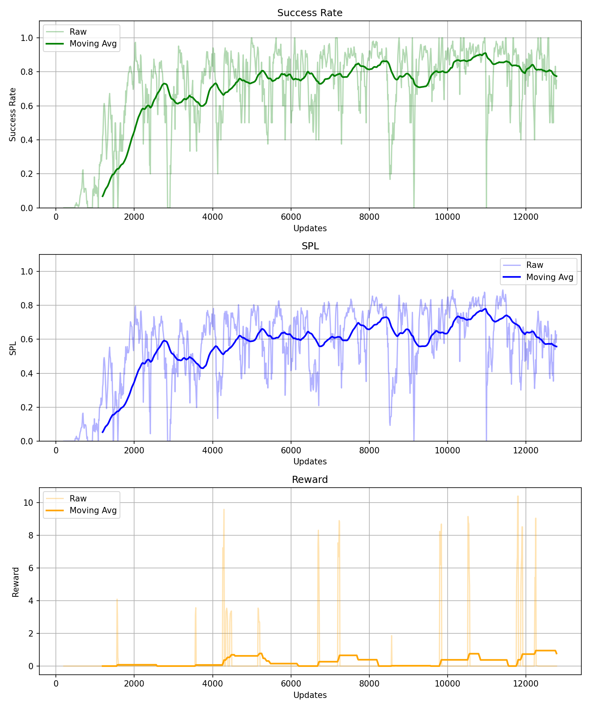

Three phases observed: (1) Learning (update 0–2000): SR rises 0→0.75;
(2) Convergence (2000–12000): stabilizes at SR~0.85, SPL~0.65;
(3) Fluctuation: caused by scene switching, not training failure.

**Reward shaping experiments**

| Experiment | Penalty | Result |
|---|---|---|
| Baseline | none | SR ~0.85, SPL ~0.65, converges fast |
| Experiment 1 | −0.5 | Failed: agent stops moving entirely |
| Experiment 2 | −0.1 | SR ~0.6, convergence 3× slower |

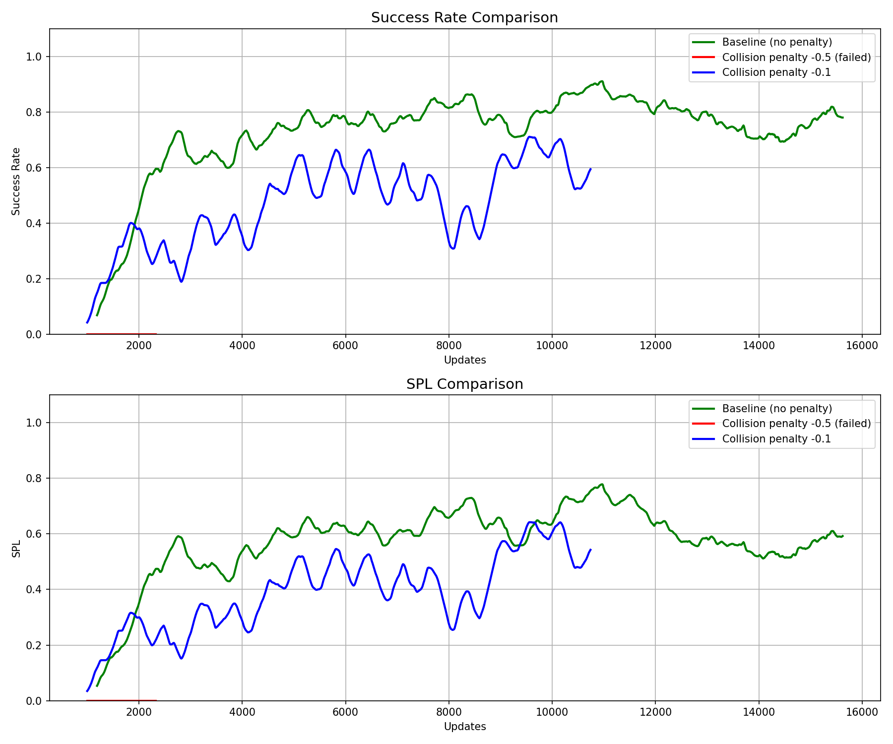

Key finding: naive collision penalties hurt more than they help.
Penalty −0.5 dominates early reward signal, preventing exploration.
Penalty −0.1 makes agent overly cautious.

**Success and failure cases**

| | |
|:---:|:---|
| 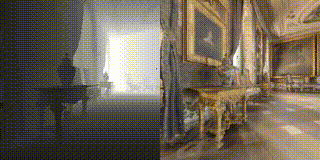 | **Success case** (SPL=0.99): Agent navigates directly to goal. |
| 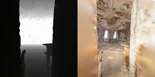 | **Failure case** (wall-stuck): Agent faces wall, no recovery strategy. |

---

#### Part 2: NeuPAN Comparison

NeuPAN (TRO 2025): model-based neural planner using MPC optimization.

| Scenario | Result | Notes |
|---|---|---|
| corridor (static) | ✅ Success | Smooth path, 0.083ms/step |
| dyna_obs (dynamic) | ❌ Failed | MPC horizon insufficient |
| non_obs (non-convex) | ✅ Success | Handles irregular shapes |

| | |
|:---:|:---|
| 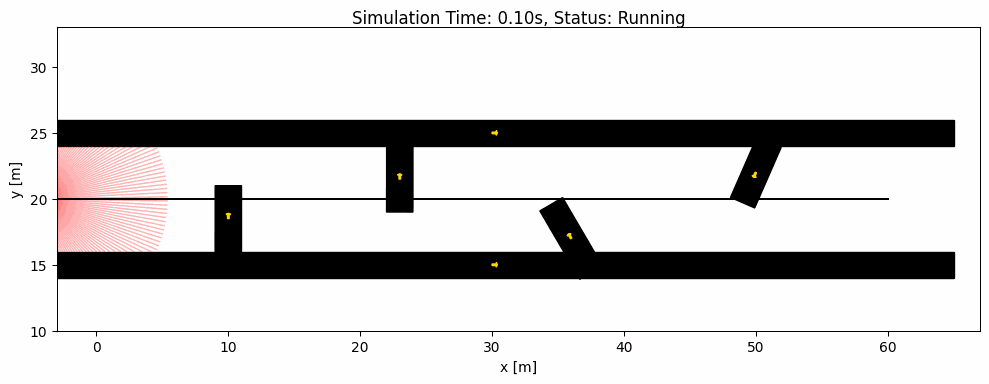 | Corridor: smooth real-time path adjustment |
| 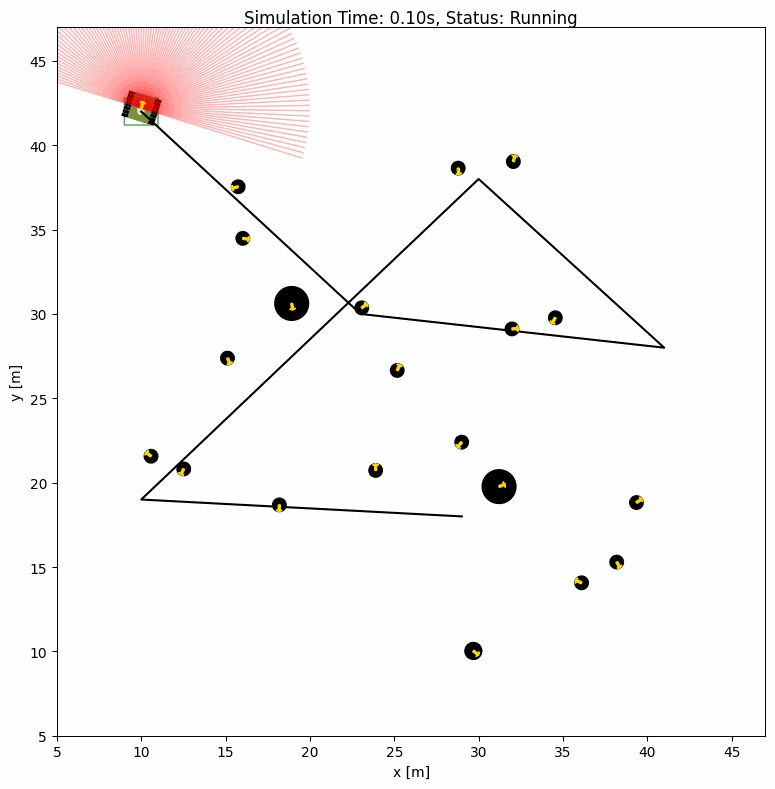 | Dynamic obstacles: collision due to fast movement |

---

#### Part 3: CNNTD3 Hard Scenario Benchmark

Trained CNNTD3 checkpoint: CNN + TD3, state_dim=185, 180-beam LiDAR.
Training: 60 epochs × 70 episodes, 3h on RTX 5060. Baseline SR=92%.

5 structured hard scenarios designed and tested:

| Scenario | SR | CR | TR | Failure Mode |
|---|---|---|---|---|
| S1 U-trap | **0%** | 0% | 100% | Freeze/oscillate inside U |
| S2 Double-U (facing up/left) | **33%** | 0% | 67% | Enters U, cannot exit |
| S3 Narrow door (0.45m) | **5%** | 95% | 0% | Collision at doorframe |
| S4 Dead-end maze | **67%** | 0% | 33% | Enters dead-end, timeout |
| S5 Symmetric corridor (facing left) | **0%** | 0% | 100% | Symmetric LiDAR deadlock |

Two core failure modes identified:

**Mode A — Concave trap (S1, S2, S4):** Goal signal points through wall;
reactive policy cannot generate backtrack behavior.

**Mode B — Symmetric deadlock (S5):** Identical upper/lower LiDAR readings
produce near-zero angular velocity; deterministic policy cannot break symmetry.

Narrow door threshold: SR=100% when width ≥ 0.6m (1.5× robot diameter),
SR≈0% when width < 0.5m.

---

#### Part 4: RCPG Training & Hard Scenario Comparison

Trained RCPG (GRU + TD3) on the same standard environment.
Training: 60 epochs × 70 episodes, ~15h on RTX 5060. Baseline SR=88%.

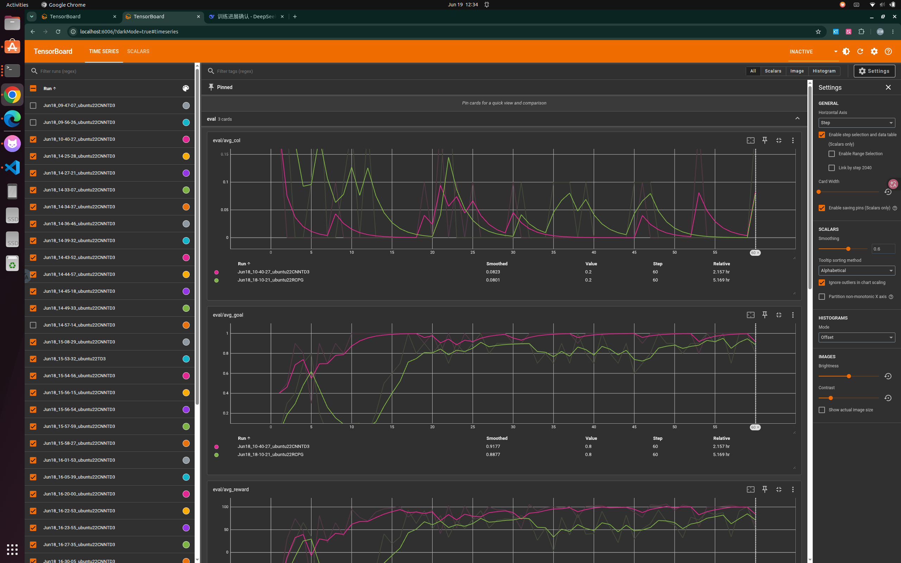.

TensorBoard eval curves: CNNTD3 (pink) converges faster (~epoch 5–10),
RCPG (green) converges later (~epoch 25) but reaches comparable SR.

Training curves: both models converge to similar avg_Q values (~105–110),
but RCPG has higher train/loss due to GRU sequential computation overhead.

**RCPG vs CNNTD3 on hard scenarios:**

| Scenario | CNNTD3 SR | RCPG SR | Δ | Interpretation |
|---|---|---|---|---|
| S1 U-trap | 0% | 0% | 0 | Both fail: neither can backtrack |
| S2 Double-U | 33% | 0% | **−33%** | GRU increases path persistence |
| S3 Narrow door | 4.8% | 90.5% | **+85.7%** | GRU enables precise alignment |
| S4 Dead-end maze | 67% | 0% | **−67%** | GRU prevents course correction |
| S5 Symmetric corridor | 83% | 100% | **+17%** | GRU breaks symmetric deadlock |

**Key finding: GRU memory is a double-edged sword.**
GRU improves precision (+85.7% narrow door) and breaks symmetry (+17%),
but actively hurts concave trap performance (−33% to −67%).
The GRU makes the agent more persistent in its trajectory — helpful
when correct, harmful when entering a dead-end.

**Root cause:** The U-trap failure (SR=0% for both) is a training
distribution problem, not an architecture problem. Neither model
saw backtracking scenarios during training.

---

#### Part 5: Literature Review — Local Minima Escape (2024–2026)

| Method | Paper | Limitation |
|---|---|---|
| APF + wall-following | Kim et al. 2024 | Requires manual trap detector |
| Reward shaping + map | Miranda et al. 2024 (IEEE TIE) | Needs map, violates mapless |
| Spatial recurrent unit | SRU, 2025 | Full architecture redesign |
| Environment prediction | DreamFlow, 2026 | Requires generative model |
| Interaction bias analysis | Jain et al. 2026 | Analysis only, no solution |

---

**Challenges & blockers**

- PyTorch 2.6 checkpoint incompatibility: fixed with weights_only=False
- Collision penalty −0.5 killed learning: documented as failed experiment
- NeuPAN dependency conflicts: resolved with separate conda env
- IR-SIM wall placement: linestring segments must be placed individually
- CNNTD3 vs TD3 class mismatch: fixed import and state_dim (185 not 25)
- RCPG training 15h (3× CNNTD3): ran overnight with hibernate disabled
- RCPG script missing world_file param: fixed manually

**Next steps**

1. Implement curriculum learning: add U-trap to training rotation
2. Add exploration reward to penalise revisiting same positions
3. Re-train with curriculum + exploration reward
4. Evaluate improved model on all 5 hard scenarios

**Hours spent:** 

**Links:**
- [Training curve](../src/training_curve.png)
- [Comparison curve](../src/comparison_curve.png)
- [TensorBoard eval](../src/tensorboard_eval.png)
- [TensorBoard train](../src/tensorboard_train.png)
- [TensorBoard loss](../src/tensorboard_loss.png)
- Success cases: [SPL=0.99](../src/success_1.gif), [SPL=0.96](../src/success_2.gif), [SPL=0.98](../src/success_3.gif)
- Failure cases: [wall-stuck](../src/failure_1.gif), [far goal](../src/failure_2.gif), [terminated](../src/failure_3.gif)
- NeuPAN: [corridor](../src/corridor_diff_ani.gif), [dynamic](../src/dyna_obs_diff_ani.gif), [non-convex](../src/non_obs_diff_ani.gif)
- Hard scenario scripts: [u-trap](../src/test_u_trap_cnntd3.py), [maze](../src/test_dead_end_maze.py), [narrow-door](../src/test_narrow_door.py), [s5-s2](../src/test_s5_s2.py), [rcpg-all](../src/test_rcpg_hard_scenarios.py)
- World files: [u-trap](../src/u_trap_world.yaml), [maze](../src/dead_end_maze_world.yaml), [narrow-door](../src/narrow_door_world.yaml), [corridor](../src/symmetric_corridor_world.yaml), [double-u](../src/double_u_world.yaml)
- Results: [u-trap](../src/u_trap_results.csv), [maze](../src/dead_end_maze_results.csv), [narrow-door](../src/narrow_door_results.csv), [s5-s2](../src/s5_s2_results.csv), [rcpg-all](../src/rcpg_hard_scenario_results.csv)

### Week 2 — 2026-06-15

**Attended this week's meeting:** Yes

**Progress this week**

- Started Habitat PPO PointNav training (official baseline):
  - Algorithm: PPO, Scene: van-gogh-room
  - update 0: success = 0.000
  - update ~650: success first appears (0.333)
  - update ~12000: success ≈ 0.85, SPL ≈ 0.65
- Fixed PyTorch 2.6 checkpoint compatibility issue
  (added weights_only=False in ddp_utils.py line 224)
  to enable resume training without deleting checkpoints.
- Generated training curve with moving average (plot_training.py).
- Ran reward shaping experiments (3 variants, see below).
- Generated success and failure episode videos, converted to GIF.
- Installed NeuPAN (TRO 2025) in separate conda environment,
  ran 3 scenarios for comparison with PPO baseline.
- Designed and built 5 structured hard-scenario test environments in IR-SIM
- Evaluated CNNTD3 (SR=92% on standard random-obstacle scenes) across all scenarios
  - Training: 60 epochs × 70 episodes, 3h on RTX 5060
  - Final eval: SR=92%, CR=8%
  - TensorBoard curves show stable convergence from epoch ~25
- Identified 2 distinct failure modes with clear root causes
- Established complete failure map as foundation for improvement design
- Trained RCPG (GRU + TD3, state_dim=185) on the same standard environment as CNNTD3 baseline:
  - Training: 60 epochs × 70 episodes, ~15h on RTX 5060
  - Final eval: SR=88%, CR=8%, comparable to CNNTD3 (SR=92%)
  - TensorBoard curves show stable convergence from epoch ~25
- Evaluated RCPG on all 5 hard scenarios and compared against CNNTD3
- Identified that GRU memory is a double-edged sword: helps in some scenarios, hurts in others
- Conducted literature review on local minima escape in mapless RL navigation

**Training curve analysis**

Three distinct phases observed:

1. Learning phase (update 0-2000): success rises from 0 to ~0.75,
   agent transitions from random exploration to goal-directed navigation.
2. Convergence phase (update 2000-12000): moving average stabilizes
   at ~0.85 success, ~0.65 SPL.
3. Fluctuation: large variance caused by scene switching in dataset,
   not a training failure.

Reward moving average stays near 0 despite high success rate,
meaning most reward comes from the sparse success bonus.
This motivates the reward shaping experiments below.

**Reward shaping experiments**

| Experiment | Penalty | Result |
|---|---|---|
| Baseline | none | SR ~0.85, SPL ~0.65, converges fast |
| Experiment 1 | -0.5 | Failed: reward stuck at -0.015, success = 0 |
| Experiment 2 | -0.1 | Learning but slow: SR ~0.6 at update 10000 |

The comparison clearly shows penalty -0.5 completely fails
(flat red line at 0), while penalty -0.1 learns slowly
(blue line lags ~3000 updates behind baseline).
Neither variant beats the baseline, which is itself a finding:
naive collision penalties hurt more than they help.

**Experiment 1 analysis (penalty = -0.5):**
Penalty too large relative to distance reward signal.
Negative reward dominated, agent learned to stay still
rather than explore. Classic reward shaping failure:
too strong a penalty prevents exploration entirely.

**Experiment 2 analysis (penalty = -0.1):**
Agent can learn but convergence is ~3x slower than baseline.
Suggests collision penalty changes exploration behavior,
making the agent more cautious at the cost of learning speed.

**Key finding:**
Reward shaping is a double-edged sword.
Too strong → training fails.
Too weak → no effect.
Careful tuning is required.

**Deeper analysis:**

The baseline reward function is sparse:
most of the learning signal comes from the +2.5 success bonus,
which the agent only receives at the very end of an episode.
This explains why early training (update 0-650) shows zero success —
the agent never reaches the goal by chance, so it receives
no positive feedback.

Adding collision penalty was intended to provide denser signal,
but introduced a new problem: the penalty dominates early training
when the agent has not yet learned to navigate,
causing it to avoid movement altogether (penalty -0.5 case)
or move very cautiously (penalty -0.1 case).

This reveals a fundamental tension in reward design:
- Dense rewards help learning speed but can distort behavior.
- Sparse rewards preserve correct behavior but slow learning.

A better approach (future work) would be potential-based reward
shaping, which provides dense guidance while mathematically
guaranteeing the optimal policy is unchanged.

**Success Cases**

| | |
|:---:|:---|
|  | **Case 1: Near-optimal navigation (SPL=0.99)**   Start: distance=1.98m → End: success=1, SPL=0.99   Agent moves directly toward goal with minimal turns.   SPL=0.99 means path was almost identical to shortest path.   Represents the best-case behavior of the trained policy. |
| 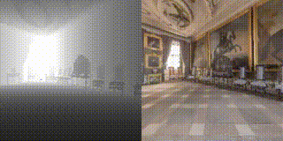 | **Case 2: Medium distance success (SPL=0.96)**   Start: distance=4.82m → End: success=1, SPL=0.96   Longer episode, agent maintains goal-directed movement.   Confirms policy generalizes across different starting distances. |
| 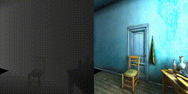 | **Case 3: van-gogh-room success (SPL=0.98)**   Start: distance=2.12m → End: success=1, SPL=0.98   Simple room layout allows agent to find efficient path.   Training scene — policy performs best in familiar environments. |

---

**Failure Cases**

| | |
|:---:|:---|
|  | **Case 1: Wall-stuck failure**   Start: distance=3.92m → End: distance=5.28m (got further away)   Agent spawns facing a wall, depth camera sees only darkness.   Repeatedly collides, moves away from goal instead of toward it.   **Root cause:** no obstacle avoidance or recovery strategy. |
| 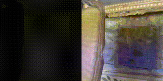 | **Case 2: Long-distance failure**   Start: distance=11.81m → End: distance=11.81m (no movement)   Goal far outside training distribution, agent barely moves.   **Root cause:** policy not generalized to long-horizon tasks.   **Proposed fix:** curriculum learning. |
| 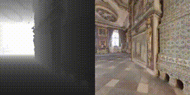 | **Case 3: Immediate termination**   Duration: 0.2s, episode ends almost instantly.   Goal distance: 12.32m — beyond policy capability.   **Root cause:** episode difficulty exceeds policy capability.   Suggests evaluation set contains unsolvable episodes, inflating failure rate. |

**NeuPAN comparison study**

NeuPAN (TRO 2025) is a model-based neural planner that directly
maps obstacle point clouds to control actions via MPC optimization.
Installed in a separate conda environment (Python 3.10) to avoid
dependency conflicts with Habitat.

| Scenario | Result | Notes |
|---|---|---|
| corridor (static obstacles) | ✅ Success | Smooth wave path, 20.4s |
| dyna_obs (dynamic obstacles) | ❌ Failed | Moving obstacles too fast |
| non_obs (non-convex obstacles) | ✅ Success | Handles irregular shapes |

| | |
|:---:|:---|
|  | **Corridor navigation**   Robot navigates through corridor with static obstacles.   Green wave trajectory shows real-time path adjustment.   Forward execution time: **0.083ms** per step.   Successfully reaches goal in 20.4s. |
|  | **Dynamic obstacles (failed)**   Moving circular obstacles cross the robot path.   Robot collides and fails to reach goal.   **Root cause:** MPC prediction horizon insufficient   for fast-moving obstacles. Known NeuPAN limitation. |
| 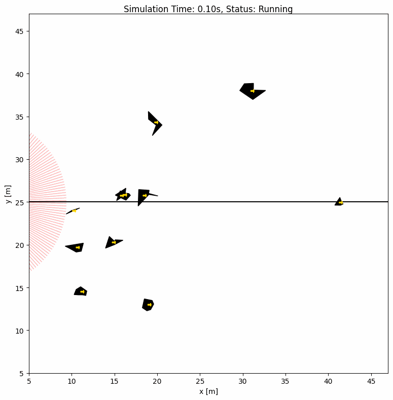 | **Non-convex obstacles**   Irregular-shaped obstacles scattered in environment.   Robot successfully navigates around all obstacles.   Point-level constraints handle arbitrary shapes without   requiring explicit shape models. |

**Key insight:**
NeuPAN is faster and more generalizable for local obstacle
avoidance. PPO learns end-to-end from raw pixels without
manual constraint design, making it more flexible for
complex tasks. The ideal system combines both: NeuPAN for
local avoidance, RL for high-level goal understanding.

---
**What worked:**
- Baseline PPO learns PointNav (SR ~0.85, SPL ~0.65)
- Training curve shows clear 3-phase learning signal
- Reward shaping experiments reveal important trade-offs
- NeuPAN demonstrates superior obstacle handling (static/non-convex)

**What did not work:**
- Collision penalty -0.5: too strong, kills exploration
- Collision penalty -0.1: enables learning but 3x slower
- Neither penalty outperforms baseline
- NeuPAN fails on fast dynamic obstacles

**Hard Scenario Benchmark: CNNTD3 Failure Analysis**

All tests use the trained CNNTD3 checkpoint (CNN + TD3, state_dim=185, 180-beam LiDAR).
Each scenario runs 15–18 episodes across varied initial orientations.

| Scenario | SR | CR | TR | Failure Mode | Root Cause |
|---|---|---|---|---|---|
| Baseline (random obstacles) | 92% | 8% | 0% | — | In-distribution, normal |
| S1 U-trap (agent inside U, goal outside) | **0%** | 0% | 100% | Freeze / oscillate | LiDAR blocked on 3 sides; goal signal points through wall; no backtrack |
| S2 Double-U (facing right) | 100% | 0% | 0% | — | Goal direction aligned with exit, no trap entered |
| S2 Double-U (facing up/left) | **33%** | 0% | 67% | Enter U, cannot exit | Agent enters concave trap along heading direction, never reverses |
| S3 Narrow door (width ≥ 0.6m) | 100% | 0% | 0% | — | Not a weakness; CNN handles narrow free space |
| S3 Narrow door (width 0.45–0.5m) | **0–5%** | 95–100% | 0% | Collision at doorframe | Door width only 0.05–0.1m > robot diameter; insufficient precision to align |
| S4 Dead-end maze | **67%** | 0% | 33% | Enter dead-end, timeout | No memory; agent cannot recognize revisited dead-end; exhausts step budget |
| S5 Symmetric corridor (facing right) | 100% | 0% | 0% | — | Initial heading matches goal direction |
| S5 Symmetric corridor (facing left) | **0%** | 0% | 100% | Symmetric oscillation | LiDAR returns identical upper/lower readings; deterministic policy produces unstable fixed point, agent cannot turn |

---

**Two Core Failure Modes Identified**

**Mode A — Concave Trap (local minimum):** Scenarios S1, S2, S4.

The agent enters a concave region. The goal-attraction signal points through the wall rather than toward the exit. Without memory of prior positions, the reactive policy has no mechanism to generate the backtrack-then-detour behavior required. The agent either freezes at the entrance or circles inside the trap until timeout.

This is a known open problem in mapless RL navigation. Wall-following heuristics (Bug algorithms) address it classically; memory-augmented policies (LSTM, GRU) are the current RL approach but remain unreliable in unstructured environments.

**Mode B — Symmetric Deadlock:** Scenario S5.

When the LiDAR input is geometrically symmetric (equal obstacle distances above and below), the deterministic TD3 policy produces near-zero angular velocity — neither turning left nor right. The agent moves forward until it hits the end wall, then stays there oscillating. This is a degenerate fixed point of a deterministic policy under symmetric observation; a stochastic policy (e.g. SAC) would break symmetry naturally.

---

**Narrow Door Threshold**

An additional finding from S3: CNNTD3 passes doors reliably when width ≥ 0.6m (1.5× robot diameter), but fails completely below 0.5m. This defines a precision boundary for the current CNN architecture.

| Door width | SR | CR |
|---|---|---|
| 0.45m | 5% | 95% |
| 0.50m | 0% | 100% |
| 0.60m | 100% | 0% |
| 0.70m | 100% | 0% |
| 0.80m | 100% | 0% |
| 1.00m | 100% | 0% |

---

| Scenario | CNNTD3 SR | RCPG SR | Difference | Interpretation |
|---|---|---|---|---|
| S1 U-trap | 0% | 0% | 0 | Both fail: neither can backtrack |
| S2 Double-U | 33% | 0% | −33% | GRU makes agent more committed to wrong path |
| S3 Narrow door (0.45m) | 4.8% | 90.5% | **+85.7%** | GRU history enables precise alignment |
| S4 Dead-end maze | 67% | 0% | −67% | GRU persistence prevents course correction |
| S5 Symmetric corridor | 83% | 100% | **+17%** | GRU breaks symmetric LiDAR deadlock |

**Key finding: GRU memory is a double-edged sword**

GRU memory improves precision navigation (+85.7% on narrow doors)
and breaks symmetry deadlock (+17% on symmetric corridors).
However, it actively hurts performance on concave trap scenarios
(−33% on double-U, −67% on dead-end maze). The GRU makes the agent
more "persistent" in its current trajectory, which helps when the
trajectory is correct (narrow passages) but prevents recovery when
the agent enters a dead-end.

**Root cause analysis**

The U-trap failure (SR=0% for both methods) is not an architecture
problem but a training distribution problem. Both models were trained
on random obstacle environments and never encountered scenarios
requiring backtracking (moving away from goal temporarily).
Memory cannot produce behaviors the agent never learned.

**Literature review: local minima escape (2024-2026)**

- Kim et al. (2024): Hybrid APF + wall-following with learned switching.
  Effective for simple traps but requires manual trap detector design.
- Miranda et al. (2024, IEEE TIE): Reward shaping with map info + SAC.
  Effective but requires map, violating mapless assumption.
- SRU (2025): Spatially-enhanced recurrent unit replacing standard LSTM.
  Shows improvement over LSTM but requires full architecture redesign.
- DreamFlow (2026): Conditional flow matching to predict beyond sensor range.
  State-of-the-art but complex, requires generative model training.
- Jain et al. (2026): Attributes reactive policy failures in U-traps
  to weak pairwise interaction biases, not just short horizons.

**Challenges & blockers**

- Hydra curly braces syntax error: resolved by hardcoding data path.
- PyTorch 2.6 checkpoint load failure: resolved by weights_only=False.
- Collision penalty -0.5 killed learning: identified and documented
  as a failed experiment, reduced to -0.1.
- Success rate shows large fluctuations during training:
  identified as normal behavior caused by scene switching,
  not a training failure.
- NeuPAN dependency conflicts: resolved with separate conda env.
- IR-SIM linestring obstacles do not form closed rooms automatically; each wall segment must be placed individually, making maze design iterative.
- CNNTD3 model uses a different class than TD3 (separate CNN architecture); had to update import and state_dim (185, not 25) before tests could run.
- World coordinate system: rectangle `length` = x-direction, `width` = y-direction at angle=0; swapping these produces rotated walls.
- RCPG training took 15h (3x longer than CNNTD3's 3h) due to GRU
  sequential computation with history_len=10. Resolved by running
  overnight with sleep/hibernate disabled.
- RCPG training script missing world_file parameter and progress
  printing; fixed by adding world_file="worlds/robot_world.yaml"
  and per-episode logging.

**Next steps**

1. Implement curriculum learning: add U-trap scenarios to training
   environment rotation in rl_train.py or rnn_train.py
2. Add exploration reward bonus to penalise revisiting same positions
3. Re-train CNNTD3 (or RCPG) with curriculum + exploration reward
4. Evaluate improved model on all 5 hard scenarios

**Hours spent:** 

**Links:**
- [Training curve (baseline)](../src/training_curve.png)
- [Comparison curve](../src/comparison_curve.png)
- [Training log baseline](../src/training_log_baseline.txt)
- [Plot script](../src/plot_training.py)
- [Success case 1 SPL=0.99](../src/success_1.gif)
- [Success case 2 SPL=0.96](../src/success_2.gif)
- [Success case 3 SPL=0.98](../src/success_3.gif)
- [Failure case 1 wall stuck](../src/failure_1.gif)
- [Failure case 2 far goal](../src/failure_2.gif)
- [Failure case 3 episode terminated](../src/failure_3.gif)
- [neupan_corridor](../src/corridor_diff_ani.gif) 
- [neupan_dyna_obs](../src/dyna_obs_diff_ani.gif) 
- [neupan_non_obs](../src/non_obs_diff_ani.gif) 
- [Test script u trap cnntd3](../src/test_u_trap_cnntd3.py)
- [Test script dead end maze](../src/test_dead_end_maze.py)
- [Test script narrow door](../src/test_narrow_door.py)
- [Test script s5 s2](../src/test_s5_s2.py)
- [World u trap](../src/robot_nav/worlds/u_trap_world.yaml)
- [World dead end maze](../src/dead_end_maze_world.yaml)
- [World narrow door](../src/narrow_door_world.yaml)
- [World symmetric corridor](../src/symmetric_corridor_world.yaml)
- [World double u](../src/double_u_world.yaml)
- [Results u trap](../src/u_trap_results.csv)
- [Results dead end maze](../src/dead_end_maze_results.csv)
- [Results narrow door](../src/narrow_door_results.csv)
- [Results s5 s2](../src/s5_s2_results.csv)
- [RCPG hard scenario results](../src/rcpg_hard_scenario_results.csv).
- [est script](../src/test_rcpg_hard_scenarios.py).

   
### Week 1 — 2026-06-6

**Attended this week's meeting:** Yes

**Progress this week**
- Installed Habitat-Lab + habitat-baselines on Ubuntu 22.04 (RTX 5060, 8GB VRAM).
- Selected reproduction target: DD-PPO (Wijmans et al., ICLR 2020).
- Studied core concepts: PointNav task, reward shaping, PPO, NeuPAN.
- Installed ROS 2 Humble on native Ubuntu 22.04 dual-boot system.
- Ran TurtleSim to verify basic ROS 2 node and topic communication.
- Locally deployed Qwen VLM (4-bit quantized, ~988MB VRAM) and built
  a mini VLN pipeline:
  natural language instruction → Qwen parses coordinates
  → ROS 2 topic → TurtleSim executes.
  Tested "go to top right corner" → successfully navigated to (10.0, 10.0).

**Challenges & blockers**
- Training instability: SR dropped from 88% to 0% on scene switch (generalization issue).
- PyTorch 2.6 / Habitat checkpoint incompatibility (`weights_only=True`): fixed by patching `ppo_trainer.py`.
- conda Python 3.9 vs ROS2 Python 3.10 conflict: resolved by separating Qwen (conda) and ROS2 (system Python) into two processes communicating via file.

**Next steps**
- Analyze success and failure cases in detail.
- Plot training curves from log data.
- Run longer PPO training for stronger baseline.

**Hours spent (optional):** 

**Links (optional):**
- [Success navigation demo](../src/success_navigation.gif)
- [Failure navigation demo](../src/failure_navigation.gif)
- [Qwen + TurtleSim demo](../src/qwen_turtlesim.png)
